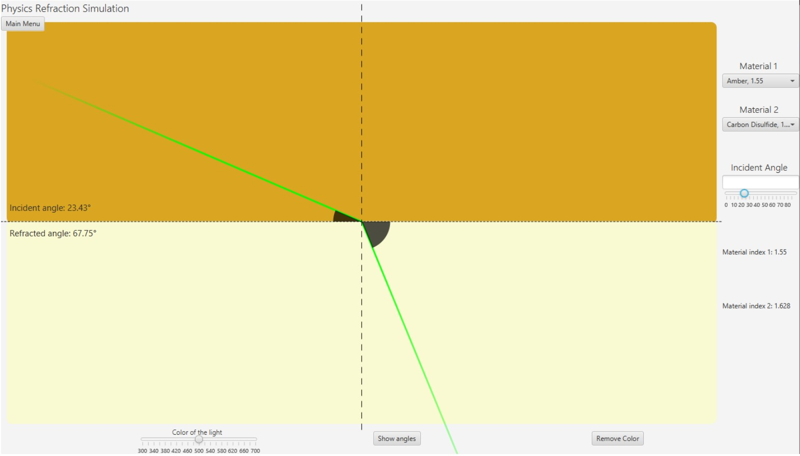
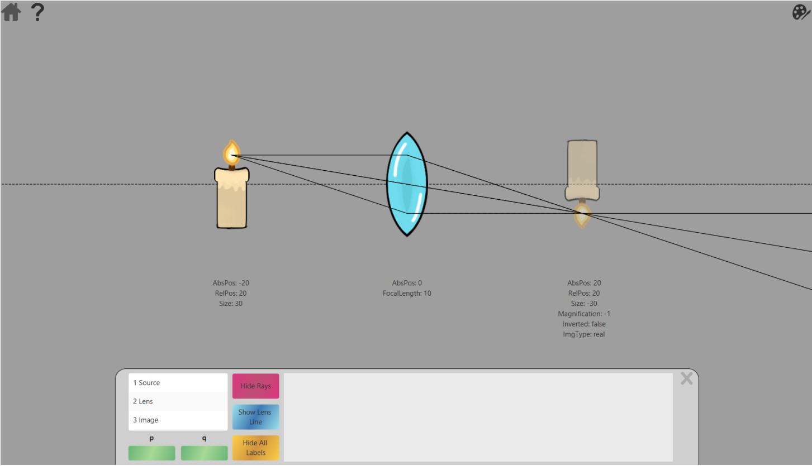
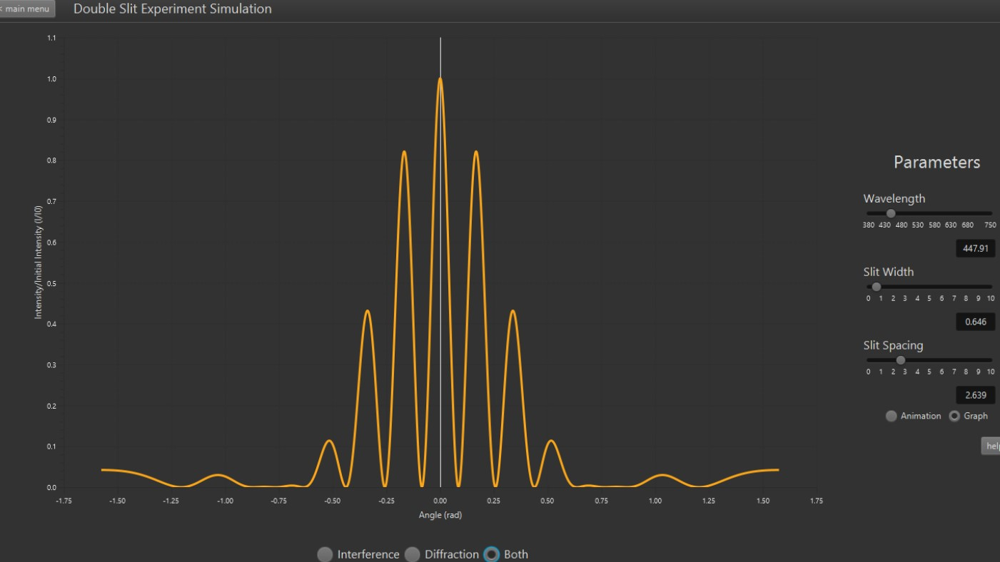
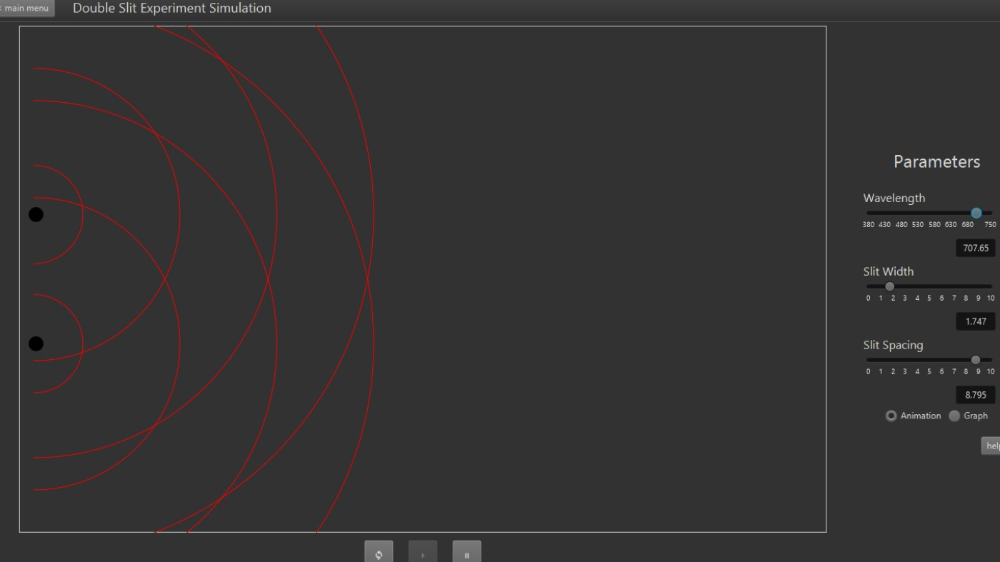
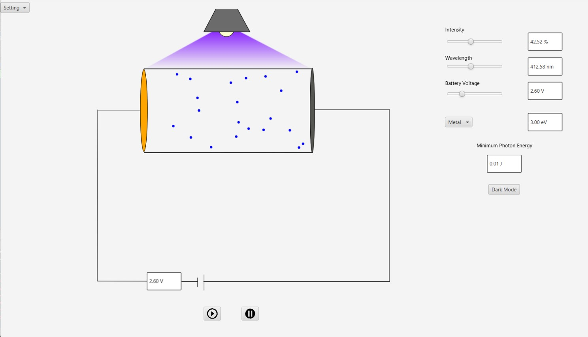

# Light Waves Simulator

---

- Vanier Computer Science and Mathematics (CSM) Term 4 Project
- Course: 420-204-RE Integrative Project in Computer Science and Mathematics

## Credits

---

- Team name: Side Characters
- Team members:
    * Sabrina Amoura
    * Matthew Hantar
    * Duc Vinh Lam
    * Maésha Mahmud

## Project Description

---
Light waves simulator is a JavaFX project built during the Winter term of 2023 for a programming class. The requirement
was to implement and demonstrate one of the scientific concepts we had learnt up until then in other courses within CSM.
We chose to make an app that could ideally let college students experiment with the four following physical concepts:
refraction (& reflection), geometric optics with thin lenses, Young’s double slit interference and diffraction
experiments,
and the photoelectric effect.

## Simulations

---

### Refraction

This simulation allows users to visualize refraction (and total internal refraction) of light rays through two mediums,
according to Snell's law.

#### Controls & Features

- Choose between preset materials for both halves of the simulation area
- Adjust the incident angle via text field OR slider
- Adjust the color of the light ray based on wavelength
- Toggle the visibility of the incident angle and refracted angle

#### Display

---

### Lenses

This simulation allows users to visualize the behavior of light rays through a thin lens and the formation of images.

#### Controls & Features

- Choose between a converging or diverging lens
- Adjust the focal length of the lens via text field OR slider
- Adjust the object and lens position via text field OR dragging
- Adjust the object size via text field
- Toggle the visibility of the principal axis, focal points, and image
- Toggle the visibility of object, lens, and image data labels
- Change background color, and object/image icons (upload image)

#### Display

---

### Double Slit

This simulation allows users to visualize the interference & diffraction patterns created by photons shot through two
slits onto a screen.

#### Controls & Features

- Adjust the wavelength of the light source
- Adjust the distance between the slits
- Adjust the width of the slits
- Change between interference, diffraction, or both
- View the patterns in graph mode and animation mode
- Play, Pause, Reset while in animation mode
-

#### Display

---

### Photoelectric

This simulation allows users to visualize the photoelectric effect and how the kinetic energy of emitted electrons
changes with the intensity of the light source.

#### Controls & Features

- Adjust the intensity of the light source
- Adjust the wavelength of the light source
- Adjust the battery voltage
- Change the metal material
- Play and pause the animation
- Built-in dark mode toggle

#### Display

